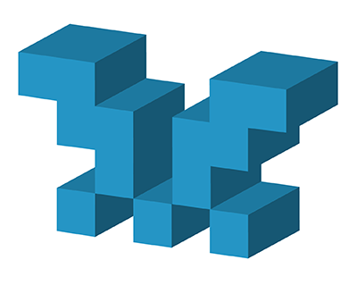

<!-- This file is autogenerated. DO NOT EDIT. -->

# iFunded Audit

 

* [1 Summary](#1-summary)
  * [1.1 Audit Dashboard](#11-audit-dashboard)
  * [1.2 Audit Goals](#12-audit-goals)
  * [1.3 System Overview](#13-system-overview)
  * [1.4 Key Observations/Recommendations](#14-key-observationsrecommendations)
* [2 Issue Overview](#2-issue-overview)
* [3 Issue Details](#3-issue-details)
* [4 Threat Model](#4-threat-model)
  * [4.1 Overview](#41-overview)
  * [4.2 Detail](#42-detail)
* [5 Tool-Based Analysis](#5-tool-based-analysis)
  * [5.1 Mythril](#51-mythril)
  * [5.2 Ethlint](#52-ethlint)
  * [5.3 Surya](#53-surya)
* [6 Test Coverage Measurement](#6-test-coverage-measurement)
* [Appendix 1  - File Hashes](#appendix-1----file-hashes)
* [Appendix 2  - Severity](#appendix-2----severity)
  * [A.2.2 - Minor](#a22---minor)
  * [A.2.3 - Medium](#a23---medium)
  * [A.2.4 - Major](#a24---major)
  * [A.2.5 - Critical](#a25---critical)
* [Appendix 3  - Disclosure](#appendix-3----disclosure)

## 1 Summary

ConsenSys Diligence conducted a security audit on ...

<!-- Provide a headline description of what you have audited and what the goal or purpose of the audited project is. 
Also add any other important context for the audit -->

### 1.1 Audit Dashboard
________________

#### Audit Details

* **Project Name: iFunded**
* **Client Name: iEstate GmbH**
* **Client Contact: Greg Freeman**
* **Lead Auditor: Daniel Luca**
* **Co-auditors: John Mardlin, Steve Marx**
* **Date: 29 April 2019**
* **Commit hash: 55cde0edba01488d99ac84a42b8e36f4ed8cdae3**

#### Number of issues by severity

| | **Minor** | **Medium** | **Major** | **Critical** |
|:-------------:|:-------------:|:-------------:|:-------------:|:-------------:|
| **Open** | **0** | **0** | **0** | **0** |
| **Closed** | **0** | **0** | **0** | **0** |

________________

### 1.2 Audit Goals

The focus of the audit was to verify that the smart contract system is secure, resilient and working according to its specifications. The audit activities can be grouped in the following three categories:  

**Security:** Identifying security related issues within each contract and within the system of contracts.

**Sound Architecture:** Evaluation of the architecture of this system through the lens of established smart contract best practices and general software best practices.

**Code Correctness and Quality:** A full review of the contract source code. The primary areas of focus include:

* Correctness
* Readability
* Sections of code with high complexity
* Improving scalability
* Quantity and quality of test coverage

### 1.3 System Overview 

#### Documentation

The following documentation was available to the audit team:
<!--
* The [README](LINK) with detailed description about the mechanics of the crowd sale.
* The [White Paper](LINK) explaining the concept behind interactive token crowd sales.
-->

#### Scope

#### Design

### 1.4 Key Observations/Recommendations  

<!-- Positive Observations: Examples 
*  The design of the system is well documented
*  The code contains many helpful comments
*  The library architecture is efficient, and innovative
-->

<!-- Recommendations: Examples

* **Test coverage is incomplete:** Any contract system that is used on the main net should have as a minimum requirement a 100% test coverage.
* **Include negative test cases:** The majority of the tests are positive test cases, meaning that the tests confirm that the system works with an expected sequence of actions and inputs. The test suite should be expanded to include more negative scenarios to ensure that the safe checks within the contract system are working correctly.  
* **High Complexity:** The multiple library/contract system is complex in nature. Additional complexity is added by having ... 
* **Stages/Time periods:**  The stages and various timings should be defined more clearly in separated control functions. Any state changing function that is called should check first against those control functions and check if it is allowed to be executed. 
* **Fix all issues:** It is recommended to fix all the issues listed in the below chapters, at the very least the ones with severity Critical, Major and Medium. All issues have also been created as issues on [GitHub](LINK).
* **Function visibility:** Best practices such as explicitly specifying function visibility should be followed.
* **Improve Documentation:** Inconsistencies exist between the white paper/documentation and implementation.  
* 
-->

## 2 Issue Overview

The following table contains all the issues discovered during the audit. The issues are ordered based on their severity. More detailed description on the levels of severity can be found in the Severity Definitions Appendix. The table also contains the status of any discovered issue.

| Chapter      | Issue Title             | Issue Status | Severity    |
| ------------ | ----------------------- | ------------ | ----------- |

## 3 Issue Details

## 4 Threat Model

The creation of a threat model is beneficial when building smart contract systems as it helps to understand the potential security threats, assess risk, and identify appropriate mitigation strategies. This is especially useful during the design and development of a contract system as it allows to create a more resilient design which is more difficult to change post-development. 

A threat model was created during the audit process in order to analyze the attack surface of the contract system and to focus review and testing efforts on key areas that a malicious actor would likely also attack. It consists of two parts a high level design diagram that help to understand the attack surface and a list of threats that exist for the contract system. 

### 4.1 Overview

### 4.2 Detail

## 5 Tool-Based Analysis

Several tools were used to perform automated analysis of the reviewed contracts. These issues were reviewed by the audit team, and relevant issues are listed in the Issue Details section.

### 5.1 Mythril 

Mythril is a security analysis tool for Ethereum smart contracts. It uses concolic analysis to detect various types of issues. The tool was used for automated vulnerability discovery for all audited contracts and libraries. More details on Mythril's current vulnerability coverage can be found [here](https://github.com/ConsenSys/mythril/wiki).

The raw output of the Mythril vulnerability scan can be found [here](./tool-output/mythril/mythril_report.md).

### 5.2 Ethlint

[Ethlint](https://www.ethlint.com/) is an open source project for linting Solidity code. Only security-related issues were reviewed by the audit team.

The raw output of the Ethlint vulnerability scan can be found [here](./tool-output/ethlint/ethlint_report.md).

### 5.3 Surya

Surya is an utility tool for smart contract systems. It provides a number of visual outputs and information about structure of smart contracts. It also supports querying the function call graph in multiple ways to aid in the manual inspection and control flow analysis of contracts.

A complete list of functions with their visibility and modifiers can be found [here](./tool-output/surya/surya_report.md).

## 6 Test Coverage Measurement

<!-- 

Testing is implemented using the YYY. XXX tests are included in the test suite and they all pass.

The [Solidity-Coverage](https://github.com/sc-forks/solidity-coverage) tool was used to measure the portion of the code base exercised by the test suite, and identify areas with little or no coverage. Specific sections of the code where necessary test coverage is missing are included in the Issue Details section.

It's important to note that "100% test coverage" is not a silver bullet. Our review also included a inspection of the test suite, to ensure that testing included important edge cases.

The state of test coverage at the time of our review can be viewed by opening the `index.html` file from the [coverage report](coverage-reports) directory in a browser.

-->

## Appendix 1  - File Hashes

The SHA1 hashes of the source code files in scope of the audit are listed in the table below.

## Appendix 2  - Severity

### A.2.2 - Minor

Minor issues are generally subjective in nature, or potentially deal with topics like "best practices" or "readability".  Minor issues in general will not indicate an actual problem or bug in code.

The maintainers should use their own judgment as to whether addressing these issues improves the codebase.

### A.2.3 - Medium

Medium issues are generally objective in nature but do not represent actual bugs or security problems.

These issues should be addressed unless there is a clear reason not to.

### A.2.4 - Major

Major issues will be things like bugs or security vulnerabilities.  These issues may not be directly exploitable, or may require a certain condition to arise in order to be exploited.

Left unaddressed these issues are highly likely to cause problems with the operation of the contract or lead to a situation which allows the system to be exploited in some way.

### A.2.5 - Critical

Critical issues are directly exploitable bugs or security vulnerabilities.

Left unaddressed these issues are highly likely or guaranteed to cause major problems or potentially a full failure in the operations of the contract.

## Appendix 3  - Disclosure

ConsenSys Diligence (“CD”) typically receives compensation from one or more clients (the “Clients”) for performing the analysis contained in these reports (the “Reports”). The Reports may be distributed through other means, including via ConsenSys publications and other distributions.

The Reports are not an endorsement or indictment of any particular project or team, and the Reports do not guarantee the security of any particular project. This Report does not consider, and should not be interpreted as considering or having any bearing on, the potential economics of a token, token sale or any other product, service or other asset. Cryptographic tokens are emergent technologies and carry with them high levels of technical risk and uncertainty. No Report provides any warranty or representation to any Third-Party in any respect, including regarding the bugfree nature of code, the business model or proprietors of any such business model, and the legal compliance of any such business. No third party should rely on the Reports in any way, including for the purpose of making any decisions to buy or sell any token, product, service or other asset. Specifically, for the avoidance of doubt, this Report does not constitute investment advice, is not intended to be relied upon as investment advice, is not an endorsement of this project or team, and it is not a guarantee as to the absolute security of the project. CD owes no duty to any Third-Party by virtue of publishing these Reports.

PURPOSE OF REPORTS The Reports and the analysis described therein are created solely for Clients and published with their consent. The scope of our review is limited to a review of Solidity code and only the Solidity code we note as being within the scope of our review within this report. The Solidity language itself remains under development and is subject to unknown risks and flaws. The review does not extend to the compiler layer, or any other areas beyond Solidity that could present security risks. Cryptographic tokens are emergent technologies and carry with them high levels of technical risk and uncertainty.

CD makes the Reports available to parties other than the Clients (i.e., “third parties”) -- on its GitHub account (https://github.com/ConsenSys). CD hopes that by making these analyses publicly available, it can help the blockchain ecosystem develop technical best practices in this rapidly evolving area of innovation.

LINKS TO OTHER WEB SITES FROM THIS WEB SITE You may, through hypertext or other computer links, gain access to web sites operated by persons other than ConsenSys and CD. Such hyperlinks are provided for your reference and convenience only, and are the exclusive responsibility of such web sites' owners. You agree that ConsenSys and CD are not responsible for the content or operation of such Web sites, and that ConsenSys and CD shall have no liability to you or any other person or entity for the use of third party Web sites. Except as described below, a hyperlink from this web Site to another web site does not imply or mean that ConsenSys and CD endorses the content on that Web site or the operator or operations of that site. You are solely responsible for determining the extent to which you may use any content at any other web sites to which you link from the Reports. ConsenSys and CD assumes no responsibility for the use of third party software on the Web Site and shall have no liability whatsoever to any person or entity for the accuracy or completeness of any outcome generated by such software.

TIMELINESS OF CONTENT The content contained in the Reports is current as of the date appearing on the Report and is subject to change without notice. Unless indicated otherwise, by ConsenSys and CD. 
